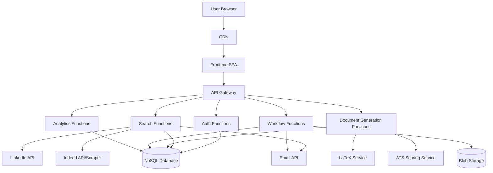

# Design Document: Job Application Automation

## Overview

The Job Application Automation system is a web application designed to streamline the job hunting process by automating job searches, resume/cover letter customization, and application tracking. The system will use a TypeScript frontend with either Go or Python for the backend, and a NoSQL database for data storage. The application will be designed as a serverless architecture to enable deployment on free-tier cloud services like Netlify.

## Architecture

The system will follow a microservices architecture to ensure modularity, scalability, and ease of deployment on serverless platforms. The architecture consists of the following main components:

### Frontend
- Single Page Application (SPA) built with TypeScript and a modern framework (React/Vue.js)
- Responsive design for desktop and mobile access
- Progressive Web App (PWA) capabilities for offline functionality

### Backend
- Serverless functions for specific operations (job searching, document generation, email processing)
- RESTful API endpoints for frontend communication
- Authentication and authorization services
- Webhook handlers for external service integrations

### Data Storage
- NoSQL database (MongoDB/Firebase) for flexible schema evolution
- Blob storage for document templates and generated PDFs
- Cache layer for frequently accessed data

### External Services Integration
- Email API (Gmail API) for email monitoring and sending
- LinkedIn API for job searches
- Indeed API or web scraping service (if API not available)
- LaTeX rendering service for document generation
- ATS scoring service for resume optimization

## Components and Interfaces

### 1. User Authentication Module
- Handles user registration, login, and profile management
- Stores user preferences, credentials for external services
- Interface: REST API endpoints for auth operations

### 2. Job Search Engine
- Connects to multiple sources (Gmail, LinkedIn, Indeed)
- Filters results based on user-defined keywords
- Extracts and processes job descriptions
- Interface: Scheduled serverless functions and REST API endpoints

### 3. Document Customization Engine
- Analyzes job descriptions for key requirements
- Customizes resume and cover letter using LaTeX templates
- Optimizes content for ATS systems
- Interface: REST API endpoints for document generation

### 4. Application Workflow Manager
- Tracks application statuses
- Processes email notifications related to applications
- Manages the application pipeline
- Interface: Event-driven serverless functions and REST API endpoints

### 5. Dashboard and Analytics
- Visualizes job search results and application statuses
- Provides analytics on application success rates
- Displays daily activities and pending tasks
- Interface: REST API endpoints for data retrieval

### 6. Email Notification Service
- Sends customized documents to the user
- Notifies users of status changes and required actions
- Interface: Serverless function triggered by events

## Data Models

### User
```json
{
  "id": "string",
  "email": "string",
  "name": "string",
  "preferences": {
    "keywords": ["string"],
    "jobTypes": ["string"],
    "locations": ["string"],
    "salaryRange": {
      "min": "number",
      "max": "number"
    }
  },
  "integrations": {
    "gmail": {
      "connected": "boolean",
      "refreshToken": "string"
    },
    "linkedin": {
      "connected": "boolean",
      "refreshToken": "string"
    }
  },
  "baseResume": "string (LaTeX format)",
  "baseCoverLetter": "string (LaTeX format)"
}
```

### JobPosting
```json
{
  "id": "string",
  "source": "string (Gmail/LinkedIn/Indeed)",
  "title": "string",
  "company": "string",
  "location": "string",
  "description": "string",
  "requirements": ["string"],
  "salary": {
    "min": "number",
    "max": "number",
    "currency": "string"
  },
  "postingDate": "date",
  "closingDate": "date",
  "url": "string",
  "keywords": ["string"],
  "matchScore": "number"
}
```

### Application
```json
{
  "id": "string",
  "jobPostingId": "string",
  "userId": "string",
  "status": "string (New/Applied/Rejected/Interview/Offer)",
  "customizedResumeId": "string",
  "customizedCoverLetterId": "string",
  "applicationDate": "date",
  "lastStatusUpdate": "date",
  "statusHistory": [
    {
      "status": "string",
      "date": "date",
      "notes": "string"
    }
  ],
  "emailThreads": ["string (email IDs)"]
}
```

### Document
```json
{
  "id": "string",
  "type": "string (Resume/CoverLetter)",
  "userId": "string",
  "jobPostingId": "string",
  "latexSource": "string",
  "pdfUrl": "string",
  "atsScore": "number",
  "creationDate": "date",
  "lastModified": "date",
  "customizations": ["string"]
}
```

### EmailMonitoring
```json
{
  "id": "string",
  "userId": "string",
  "applicationId": "string",
  "emailId": "string",
  "subject": "string",
  "sender": "string",
  "receivedDate": "date",
  "content": "string",
  "classification": "string (Rejection/Interview/Offer/Other)",
  "processed": "boolean"
}
```

## Error Handling

### Frontend Error Handling
- Client-side validation for all user inputs
- Graceful degradation when services are unavailable
- Offline mode with synchronization when connection is restored
- Comprehensive error messages with suggested actions

### Backend Error Handling
- Structured error responses with appropriate HTTP status codes
- Retry mechanisms for transient failures in external service calls
- Circuit breaker pattern for failing external services
- Comprehensive logging for debugging and monitoring
- Fallback mechanisms when primary services are unavailable

### Data Integrity
- Validation before database operations
- Transaction support for critical operations
- Regular data backups
- Conflict resolution strategies for concurrent modifications

## Testing Strategy

### Unit Testing
- Frontend component testing with Jest and React Testing Library
- Backend unit testing with appropriate framework (Go: testing package, Python: pytest)
- Mock external services for isolated testing

### Integration Testing
- API endpoint testing with supertest or similar tools
- Database integration testing with test databases
- External service integration testing with mocks or test accounts

### End-to-End Testing
- User flow testing with Cypress or similar tools
- Automated UI testing for critical paths
- Performance testing for critical operations

### Continuous Integration
- Automated test runs on code commits
- Code quality checks (linting, static analysis)
- Security vulnerability scanning

## Security Considerations

### Authentication and Authorization
- JWT-based authentication
- Role-based access control
- Secure password storage with bcrypt or similar

### Data Protection
- Encryption of sensitive data at rest
- HTTPS for all communications
- API key rotation for external services
- Secure handling of OAuth tokens

### External Service Security
- Minimal permission scopes for OAuth integrations
- Secure storage of API keys and tokens
- Regular audit of external service access

## Deployment Architecture



## Implementation Considerations

### Frontend Framework Selection
- React with TypeScript for component-based UI development
- Redux or Context API for state management
- Material-UI or Tailwind CSS for responsive design

### Backend Language Selection
- Python with FastAPI for rapid development and good async support
- Alternatively, Go for performance and lower resource usage

### Database Selection
- MongoDB for flexible schema and good serverless integration
- Alternatively, Firebase Firestore for simplified backend development

### Serverless Platform
- Netlify Functions for frontend-proximate functions
- AWS Lambda or Google Cloud Functions for more complex operations
- Vercel for integrated frontend/backend deployment

### LaTeX Processing
- Overleaf API for LaTeX rendering if available
- Self-hosted LaTeX microservice using TeX Live
- PDF generation with LaTeX to PDF converters

### ATS Optimization
- Integration with existing ATS scoring APIs
- Keyword extraction and matching algorithms
- Machine learning for resume optimization based on successful applications